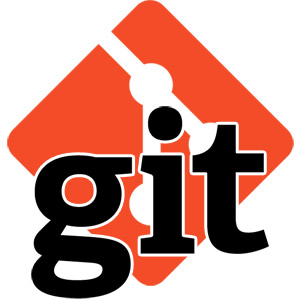

# Гид по GIT
---

LICENSE: [MIT](./license.md)

----

GIT logo by Alex Kras http://www.alexkras.com/19-git-tips-for-everyday-use/

----

## *Содержание:*

---

>1. [Подготовка](./preparation.md)
>2. [Создание репозитория: **git init**](./repository_creation.md)
>3. [Добавление файла в индекс: **git add**](./add.md)
>4. [Отправка изменений в репозиторий: **git commit**](./commit.md)
>5. [Проверка состояния репозитория: **git status**  ](./examination.md)
>6. [Сохранение изменений в репoзитории: **git push**](./push.md)
>7. [Клонирование репозитория: **git clone**](./clone.md)
>8. [Продолжение следует:](./next.md)

## *Список использованных источников:*

---
+ Краткое руководство по Markdown [1]
+ GitHowTo [2]
+ Googl-переводчик [3]

[1]: https://codepen.io/paulradzkov/pen/ZGoLgr
[2]: https://githowto.com/ru
[3]: https://translate.google.com/?sl=en&tl=ru&op=translate&hl=ru

---

---

